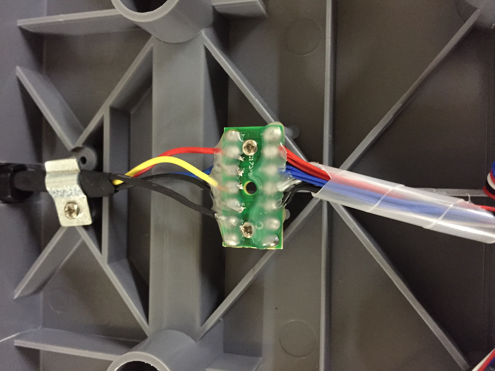
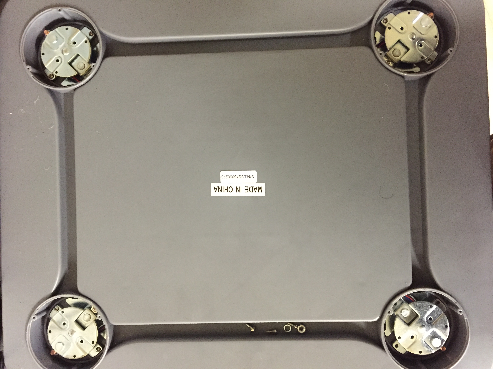
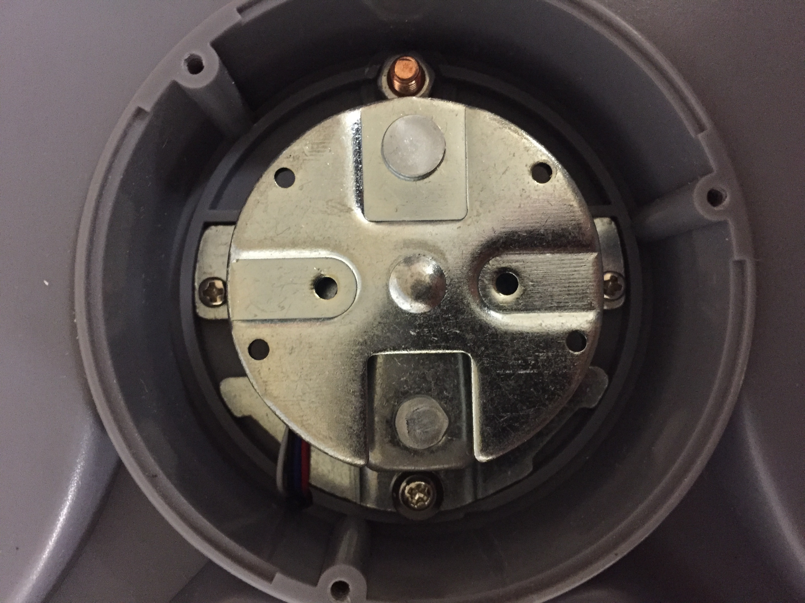
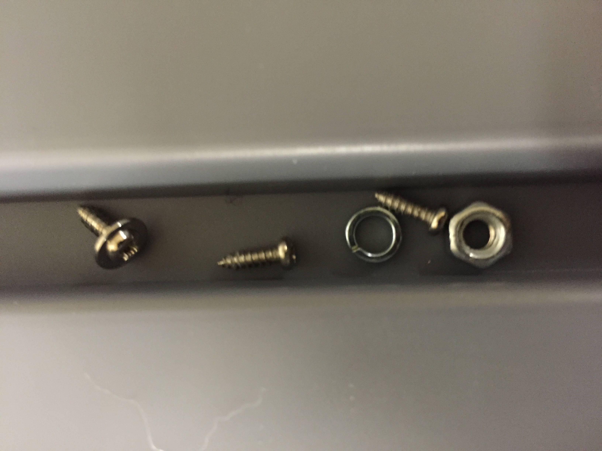
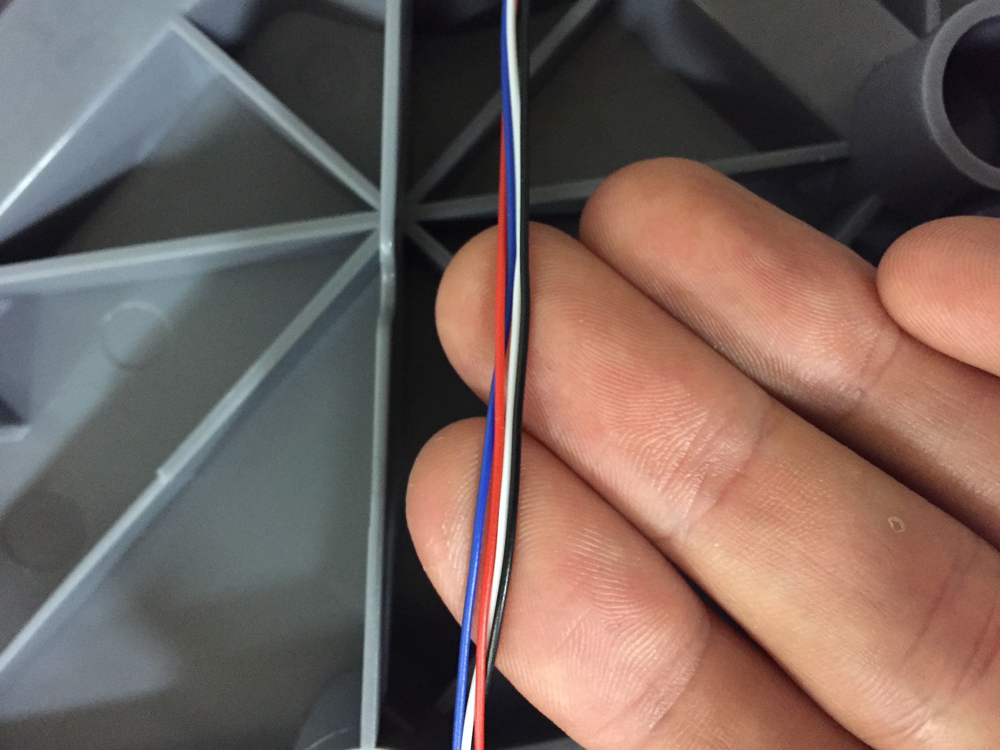
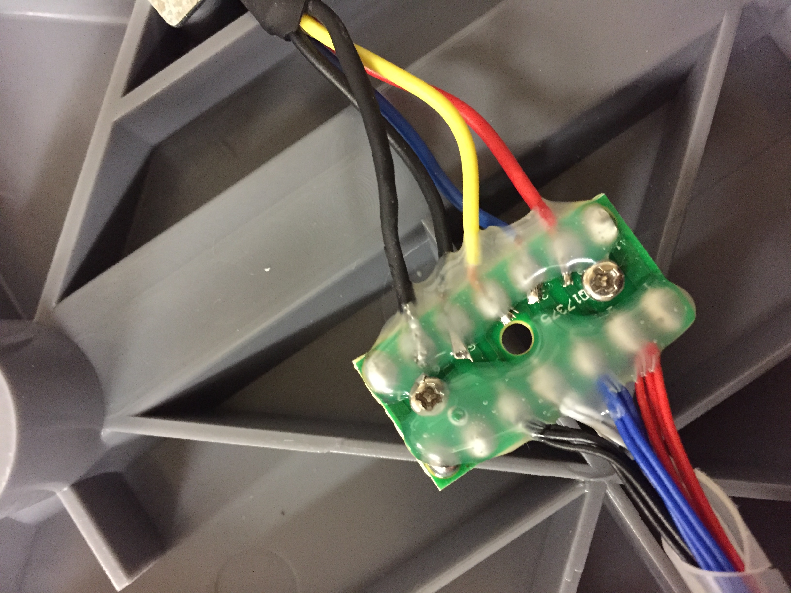

## The build

### Taking it apart

10/12/2016 we got the [Tree from LW Measurements, LLC](https://www.amazon.com/gp/product/B008M8FND6/ref=oh_aui_detailpage_o03_s00?ie=UTF8&psc=1) and started disassembling it. Ultimately, we realized that it already came with a load combinator, so our disassembly was unnecessary. Great news for future bee hive hackers – you don't need to take it apart!

### Putting it back together

For the sake of being able to put the blasted thing back together I'm going to detail the whole thing with a nauseating array of pictures.

Here is the scale without the feet. There are 3 screws and a nut holding each balast in place:

### What now?

Even with one piece of the puzzle out of the way, we will still need a way to interpret the output generated by the combinator. The readings that it would put out with any interception would be indecipherable, so we will need an amplifier to make sense of the data put out by the load balancer.

Enter HX711. The [HX711](https://www.sparkfun.com/products/13879) allows us to translate load balancer data to Serial. Once we get to that point, there is an Arduino library, [also called HX711](https://github.com/bogde/HX711), that allows us to interface with the HX711's Serial output. 

SparkFun has a few helpful guides on load sensors:
* [Getting Started with Load Cells](https://learn.sparkfun.com/tutorials/getting-started-with-load-cells)
* and more applicable to this project, [Load Cell Ampliphier HX711 Breakout Hookup Guide](https://learn.sparkfun.com/tutorials/load-cell-amplifier-hx711-breakout-hookup-guide)

<!-- The latter guide indicates that we will need 5 input cables: -->
> The four wires coming out from the wheatstone bridge on the load cell are usually:
* Excitation+ (E+) or VCC is red
* Excitation- (E-) or ground is black.
* Output+ (O+), Signal+ (S+)+ or Amplifier+ (A+) is white
* O-, S-, or A- is green or blue

**Our cables coming out of the load cells are blue, red, white, and black**

The plot thickens when we reach the combinator as we gain an extra black cable and the blue becomes a green
`Blue | Red | White | Black` => `Green | Red | White | Black | Black`

Based on the following image, and this explanation, I think it is safe to assume that we can combine the two black cables and connect to the HX711 with the four remaining pins.

> Now, if you would like to set up four single load sensors with our combinator board and amplifier, connect the five pins labeled RED, BLK, WHT, GRN, YLW to the matching pins on the HX711. Next, connect each of the four load sensors to the following pins

MORE TO COME!